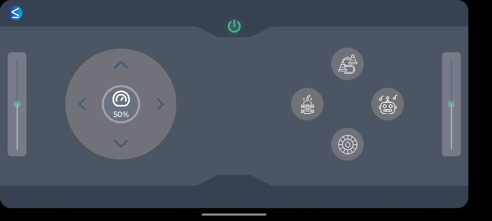

# rcbot: Remote Control App for ESP32 Robot

**RoboControl** is a React Native mobile app designed to control a robot powered by an ESP32 microcontroller. The app features an intuitive gamepad-style interface, allowing users to remotely steer the robot in multiple directions, such as forward, backward, left, and right.

  

## Features

- **Gamepad Layout**: A simple and intuitive '+' style control layout for easy robot navigation.
- **Real-time Control**: Seamless communication with the robot for real-time movements via Bluetooth or Wi-Fi.
- **ESP32 Integration**: Built to interface with ESP32, enabling robot control through React Native.
- **Responsive UI**: Supports different screen sizes, ensuring a smooth user experience across mobile devices.

## Screenshots

## Tech Stack

- **React Native**: Frontend framework used to build the app.
- **NativeWind**: For styling the app using Tailwind CSS concepts.
- **ESP32**: Microcontroller that interfaces with the app to control the robot's movements.
- **Bluetooth/Wi-Fi**: Communication protocol used to control the robot in real time.

Installation
Prerequisites

    Node.js & npm
    React Native 
    ESP32 with MicroPython (for robot control)

Steps

    Clone the repository:

    bash

git clone https://github.com/your-username/robo-control.git
cd robo-control

Install dependencies:

bash

npm install

Start the app:

    For React Native CLI:

    bash

npx react-native run-android

For Expo:

bash

        expo start

    ESP32 Setup:
        Ensure the ESP32 is running MicroPython and is configured to accept commands via Bluetooth or Wi-Fi.
        Flash your ESP32 with the correct firmware for robot control.
        Modify the ESP32 script to communicate with the app.

Usage

    Launch the app and connect it to your robot (via Bluetooth or Wi-Fi).
    Use the '+' styled control buttons to move the robot forward, backward, left, or right.
    Adjustments to robot speed and control sensitivity can be configured within the app settings.

Communication Protocol

The app communicates with the ESP32 via Wi-Fi. Here's a quick overview of how the data is structured:

    Forward Command: 'F'
    Backward Command: 'B'
    Left Turn Command: 'L'
    Right Turn Command: 'R'

These commands are sent to the ESP32, which then translates them into motor control signals for the robot.
Contributing

    Fork the repository.
    Create a new branch (feature/my-new-feature).
    Commit your changes.
    Push the branch and open a pull request.

License

This project is licensed under the MIT License - see the LICENSE file for details.
Future Plans

    Adding support for camera streaming from the robot.
    Implementing more complex robot maneuvers, like obstacle avoidance.
    Incorporating voice commands for hands-free control.
